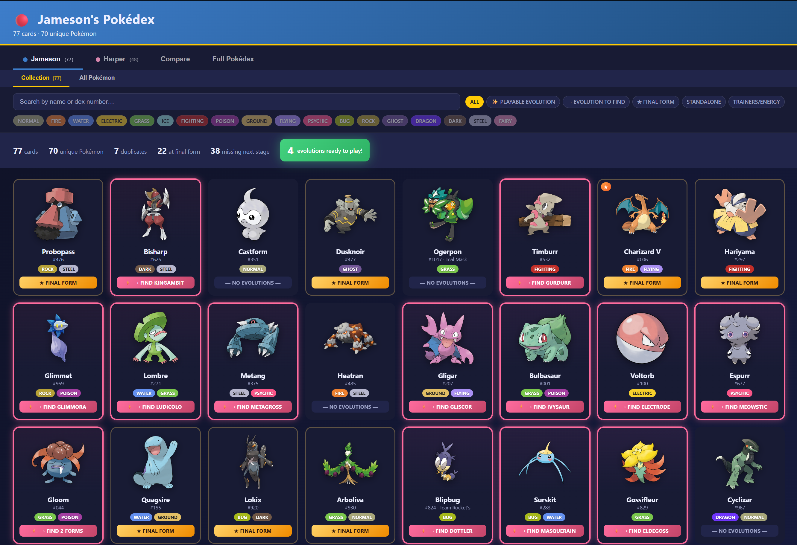
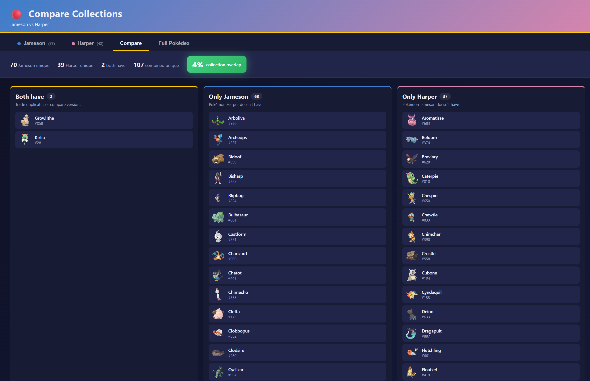
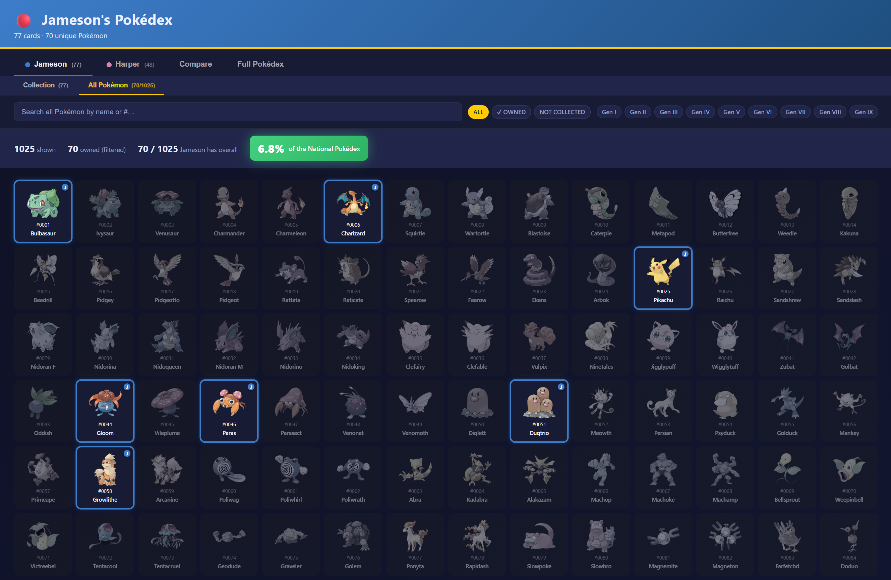

# barrl-pokedex

Family Pokémon TCG collection tracker. Static single-page app — no build step, no backend.

**🔴 Live at [barrl-dev.github.io/barrl-pokedex](https://barrl-dev.github.io/barrl-pokedex/)**



Loads each kid's collection from `kids/<name>.json`, fetches sprites / types / evolution chains live from [PokéAPI](https://pokeapi.co/), and renders three views:

- **Per-kid collection** — cards grouped by Pokémon, with playable evolutions highlighted in green (a card glows green when its next-stage evolution is also in the collection — i.e. the kid can actually play the evolution)
- **Compare** — what both kids have, what each has uniquely, and cross-evolution trade ideas
- **Decks** — top tournament decks scraped from [Limitless TCG](https://play.limitlesstcg.com/decks?format=standard), ranked by how many of each kid's Pokémon match the recipe. Click a deck to see the full 60-card list with each row marked owned (✓) or missing (○).
- **Full Pokédex** — all 1025 species with per-kid ownership badges

| Compare collections | Full Pokédex (per-kid ownership) |
|---|---|
|  |  |

## Running locally

Any static file server works. From the project root:

```bash
python -m http.server 8000
```

Then open http://localhost:8000. Other devices on the same Wi-Fi can use `http://<your-ip>:8000`.

## Adding a new kid

1. Drop their card photos into a new subfolder: `SourceImages/<name>/`.
2. Create `kids/<name>.json`. Either copy `kids/jameson.json` as a template, or use the **LLM workflow** below to generate it from photos.
3. Open `index.html` and update the kid registry near the top of the script:

   ```js
   const KIDS = ["jameson", "harper", "<name>"];
   const KID_LABEL = { jameson: "Jameson", harper: "Harper", <name>: "<Display Name>" };
   ```

4. Add a tab button in the `.kid-picker` markup and a CSS color variable if you want a unique theme color.

## Generating a collection with an LLM

For new collections, photograph the cards in batches (3×3 grids of 9 cards per shot work well — keep the camera steady and parallel to the cards) and feed them to a vision-capable LLM (Claude, ChatGPT, Gemini) along with the prompt below. Verify the output before committing — even good models miss cards or misread similar Pokémon.

### Workflow

1. Lay out cards in a grid; take one photo per group of ≤9 cards.
2. Save photos to `SourceImages/<name>/`.
3. Open a new chat, attach the photos, and paste the prompt below (substituting `<name>`).
4. Save the model's JSON output as `kids/<name>.json`.
5. Reload the app and use the **📷 source** link on any uncertain card to verify against the original photo.

### Prompt

````
You are helping me catalog a Pokémon TCG collection into a JSON file for a static
web app. I'll attach photos of cards laid out in a grid. For each photo, identify
every card and produce a single JSON file at the end matching this exact schema:

{
  "owner": "<Name>",
  "title": "<Name>'s Pokémon Collection",
  "color": "#<hex>",
  "cards": [
    { "name": "bulbasaur", "display": "Bulbasaur", "src": "<name>/<filename>.jpg" }
  ]
}

Rules:

1. One entry per physical card — duplicates are separate entries, with
   `"duplicate": true` on the 2nd-and-later copies of the same Pokémon.

2. The `name` field must be the lowercase PokéAPI species name (e.g. `tapu-koko`,
   `mr-mime`, `ho-oh`, `weezing` for any Weezing form). Special variants go in
   `"variant"`, e.g. `{"name": "weezing", "variant": "Galarian"}`.

3. The `src` field must be the path under SourceImages/, e.g.
   `"<name>/PXL_20260430_222302116.jpg"`.

4. **Read the collector number off the card** (small text in a corner, usually
   bottom-left or bottom-right, formatted like `125/197` or `TG29/TG30`). Put
   the part BEFORE the slash in the `number` field as a string. Example:
   `{"name": "charizard", "display": "Charizard ex", "number": "125", ...}`.
   If the number is unreadable, omit the field — that's fine, the app falls
   back to a generic sprite.

   If you can also identify the SET (set name printed near the bottom, e.g.
   "Obsidian Flames", "Paldea Evolved", or a 3-letter code like OBF / PAL),
   add a `set` field with the pokemontcg.io set ID. Common recent IDs:
   `sv1` Scarlet & Violet base, `sv2` Paldea Evolved, `sv3` Obsidian Flames,
   `sv3pt5` 151, `sv4` Paradox Rift, `sv4pt5` Paldean Fates, `sv5` Temporal
   Forces, `sv6` Twilight Masquerade, `sv6pt5` Shrouded Fable, `sv7` Stellar
   Crown, `sv8` Surging Sparks, `sv8pt5` Prismatic Evolutions, `sv9` Journey
   Together. Older Sword & Shield: `swsh1` … `swsh12pt5`. If you're unsure,
   omit `set` — `number` alone is usually enough to disambiguate.

5. For non-Pokémon cards (energy, items, trainers/supporters), use:
     {"kind": "energy",  "display": "Fighting Energy", "category": "fighting", "number": "...", "src": "..."}
     {"kind": "item",    "display": "Quick Ball",       "number": "...", "src": "..."}
     {"kind": "trainer", "display": "Iono",             "number": "...", "src": "..."}
   These have NO `name` field — `kind` distinguishes them. Still capture
   `number` (and `set` if you can) so we can fetch the real card image.

6. If you're not confident about an identification, add `"uncertain": true`
   and `"note": "<what you saw — HP, attack name, color, anything that helps a human verify>"`.
   Do NOT guess silently. It's far better to flag uncertainty than to be wrong.

7. List cards in reading order within each photo (left-to-right, top-to-bottom),
   and process photos in the order I attach them. Add a comment-style separator
   only if it helps your reasoning — strip it before producing the final JSON.

8. The final output must be ONLY valid JSON — no prose, no markdown fence, no
   trailing commentary. Pretty-print it.

When you're not certain, name the closest matching real Pokémon and flag it as
uncertain. Common confusions to be careful of:
  - Pansear vs Pyroar vs Vulpix vs Cyndaquil (small fire pokémon)
  - Buizel vs Floatzel vs Sealeo (blue water creatures)
  - Sentret vs Yungoos vs Stantler vs Sandygast (small tan creatures)

Photos attached.
````

### Tips

- **High resolution helps.** Phone photos straight off the device are usually fine; downscaled or compressed images produce more uncertainty.
- **Even lighting**, no glare on holo cards.
- **Layouts**: 3×3 grids of distinct cards. Avoid overlapping cards.
- **One pass per photo set.** Don't stitch multiple chats together — context loss leads to duplicates and miscounts.
- **Always verify** the `uncertain: true` cards by clicking the 📷 source link. Most LLMs (this app's history included) will confidently misidentify look-alikes.
- After fixing one round of mistakes, ask the model to flag any cards it has < 95% confidence on, then iterate.

## Card data format

`kids/<name>.json` is a flat list — one entry per physical card. Duplicates are separate entries.

```json
{
  "owner": "Jameson",
  "title": "Jameson's Pokémon Collection",
  "color": "#3d7dca",
  "cards": [
    { "name": "bulbasaur", "display": "Bulbasaur", "src": "jameson/PXL_20260430_205536313.jpg" }
  ]
}
```

### Pokémon card fields

| Field | Required | Notes |
|---|---|---|
| `name` | yes | lowercase PokéAPI name (e.g. `tapu-koko`, `mr-mime`, `weezing`) |
| `display` | yes | how it shows in the UI |
| `number` | recommended | collector number printed on the card (e.g. `"125"`, `"TG29"`, `"199"`) — used to look up the exact print on [pokemontcg.io](https://docs.pokemontcg.io/) so we can show the real card image and attack data |
| `set` | optional | pokemontcg.io set ID (e.g. `"sv4"`, `"swsh12pt5"`). Helps disambiguate. Usually unnecessary if `number` is unique enough |
| `src` | recommended | photo path under `SourceImages/`, used by the 📷 source link |
| `duplicate` | optional | `true` flags a 2nd-or-later copy |
| `rarity` | optional | shown under the name (e.g. `"V"`, `"ex"`) |
| `variant` | optional | short note like `"Galarian"` or `"Team Rocket's"` |
| `note` | optional | freeform note shown in the modal |
| `uncertain` | optional | `true` puts a red "verify?" corner badge on the card |

If `number` is present, the app fetches the real card image and TCG-specific data (attacks, energy costs, HP) from pokemontcg.io. If absent, it falls back to a generic Pokémon sprite from PokéAPI.

### Non-Pokémon cards (energy, items, trainers)

```json
{ "kind": "energy",  "display": "Fighting Energy", "category": "fighting", "src": "..." }
{ "kind": "item",    "display": "Quick Ball",      "src": "..." }
{ "kind": "trainer", "display": "Iono",            "src": "..." }
```

These render with a generic icon (⚡ / 🎒 / 👤) instead of a sprite, skip the PokéAPI fetch, and live behind the **Trainers/Energy** filter.

## Refreshing deck recipes

The Decks tab reads from `decks/standard.json`, which is committed to the repo. To refresh it from the latest Limitless TCG meta:

```bash
node scripts/refresh-decks.mjs
```

Requires Node 18+. No npm install — uses built-in fetch. Takes ~2 minutes (it's gentle with Limitless's servers). Commit the regenerated file when you're happy.

## Project layout

```
index.html              — single-file app
kids/<name>.json        — one file per kid
SourceImages/<name>/    — original card photos
decks/standard.json     — scraped tournament decks (refresh with the script)
scripts/refresh-decks.mjs — Node scraper for the deck file
```

PokéAPI responses and the species list are cached in `localStorage` so reloads are instant. Bump the cache key constants in `index.html` if you ever need to invalidate.
